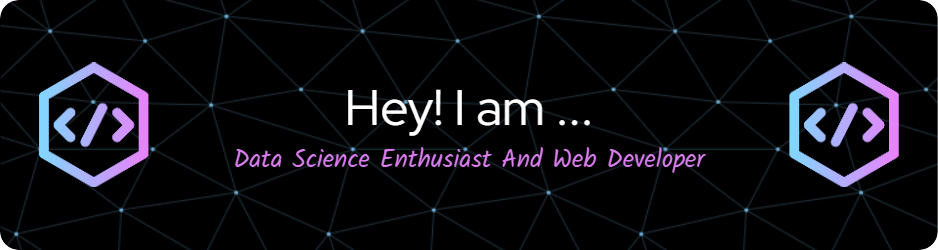

<h1 align="center">Hello Everyone 👋, I'm Priya Anandhan</h1>

  

<h3 align="center">Hello! I'm Priya , a passionate Data Scientist and Web Developer.</h3>

  

- 🔭 I’m currently pursuing Btech.Artificial Intelligence & Data Science

- 🌱 I’m currently learning **Data Science , Visualization , Front end development**

- 👨‍💻 All of my projects are available at [Portfolio](https://priyaanandhan.netlify.app/)

- 💬 Ask me about **Data Science & Analytics , Web Development**

- 📫 How to reach me **priyaanandhan1307@gmail.com**

<h3 align="left">Connect with me:</h3>

  

<h3 align="left">Languages and Tools:</h3>
<h3 align="left">Languages and Tools:</h3>

              

&nbsp;

